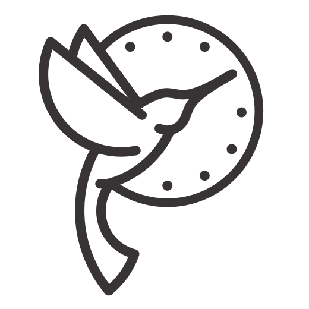
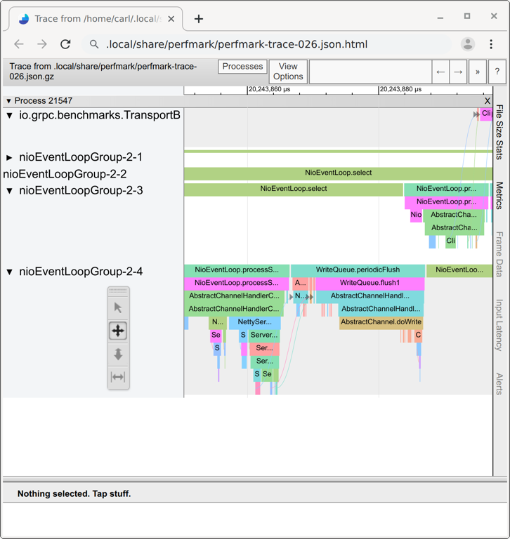

# PerfMark



PerfMark is a low-overhead, manually-instrumented, tracing library for Java.  Users can add the
tracing function calls to their code to see how long each part takes.

## Features

*   **Very Low Overhead**:  When enabled, tracing a function call adds about **70ns**.   Tracing is
    done in a lock-free, wait-free, thread local buffer, which avoids interfering with your 
    latency-sensitive code.
    
*   **Dynamically Enabled**: PerfMark can be enabled or disabled at runtime.  When disabled, 
    PerfMark has *zero overhead*, taking advantage of the JIT compiler to remove the tracing.
    
*   **Inter-thread Communication**: Existing profilers have difficulty expressing which thread 
    wakes up and executes work on another thread.  PerfMark allows users to express this 
    relationship explicitly, making for a clear picture of how code flows.

*   **Small Library Size**: The PerfMark tracing API is only *5 KB* in size, and has minimal 
    dependencies making it easy to include in other projects.  If no backend for recording the trace
    is present, the library safely disables itself.

*   **Multiple Java Versions**: The PerfMark API supports Java 6, making it easy to include on 
    older or constrained environments.  Additionally, PerfMark includes optimized backends for 
    Java 6, Java 7, and Java 9.  Each of these backends is automatically loaded at runtime 
    (if possible) and uses advanced JVM features for maximum speed. 

*   **Chrome Trace Viewer Integration**: PerfMark can export to the Chrome Trace Event Format, 
    making it easy to view in your Web Browser.
    
## Usage

To use PerfMark, add the following dependencies to your `build.gradle`:
```
dependencies {
    implementation 'io.perfmark:perfmark-api:0.25.0'
    // Only needed for applications, not libraries.
    implementation 'io.perfmark:perfmark-traceviewer:0.25.0'
}
```

Or in your `pom.xml`:

```
    <dependency>
      <groupId>io.perfmark</groupId>
      <artifactId>perfmark-api</artifactId>
      <version>0.25.0</version>
    </dependency>
```

In your code, add the PerfMark tracing calls like so:

```java
Map<String, Header> parseHeaders(List<String> rawHeaders) {
  try (TaskCloseable task = PerfMark.traceTask("Parse HTTP headers")) {
    Map<String, String> headers = new HashMap<>();
    for (String rawHeader : rawHeaders) {
      Header header = parseHeader(rawHeader);
      headers.put(header.name(), header);
    }
    return headers;
  }
}

```

PerfMark can also be used to record asynchronous work:

```java
Future<Response> buildResponse() {
  try (TaskCloseable task = PerfMark.traceTask("Build Response")) {
    Link link = PerfMark.linkOut();
    return executor.submit(() -> {
      try (TaskCloseable task2 = PerfMark.traceTask("Async Response")) {
        PerfMark.linkIn(link);
        return new Response(/* ... */);
      }
    });
  }
}
```

To view the traces in your browser, generate the HTML:

```java
  PerfMark.setEnabled(true);
  PerfMark.event("My Task");
  TraceEventViewer.writeTraceHtml();
```

The output looks like:



## Configuration 
PerfMark provides some System Properties that allow controlling how it initializes.  These can be set
by providing them as JVM arguments.  (e.g. `-Dio.perfmark.PerfMark.startEnabled=true`)

* `io.perfmark.PerfMark.startEnabled` controls if PerfMark starts enabled.  This boolean property
    makes it possible to start tracing calls immediately.  This is helpful when it's difficult
    to invoke `setEnabled()` on PerfMark before task tracing calls have started.

* `io.perfmark.PerfMark.debug` controls if PerfMark can log initializing steps.  This property 
    exists to disable class loading of the logger package (currently `java.util.logging`).  If
    the debug property is set, the logger settings still need to be configured to report the logs.
    By default, all PerfMark logs use level `FINE` (SLF4J `DEBUG`) or lower, which means that they
    usually need additional setup to print.
  
    In addition to initialization, the debug property controls if other tracing failures can be 
    logged. When calls involving deferred execution are used (e.g. 
    `startTask(T, StringFunction<T>)`), the String function provided may throw an exception.  In
    these cases, the exception is silently ignored.  This makes it easy to ensure the start/stop
    call parity is maintained.  To view these failures, the debug property can be set to log such
    problems.  As above, the PerfMark logger should be configured as well to report these.

## Versioning and API Stability

PerfMark uses Semantic Versioning, and thus will not break existing APIs within a minor version 
update.  PerfMark may need to disable some functionality, and thus may need to make some tracing 
calls become No-ops.  In such cases, it will remain safe to call these functions being recorded.

## Users

PerfMark was designed originally for [gRPC](https://github.com/grpc/grpc-java). It is also used
by [Zuul](https://github.com/Netflix/zuul).
